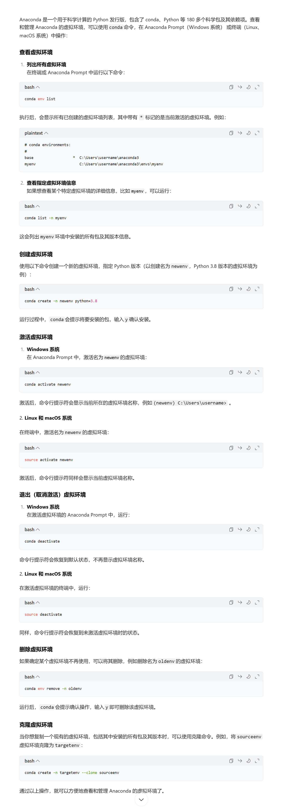
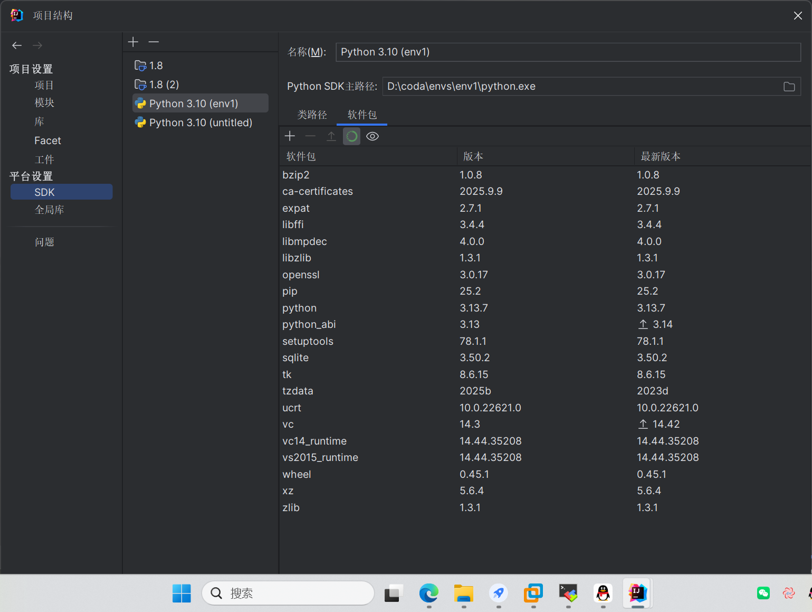
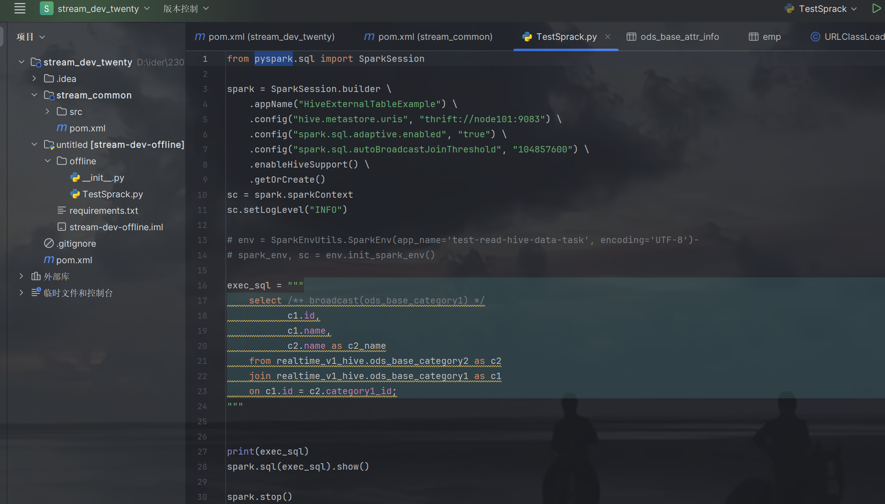
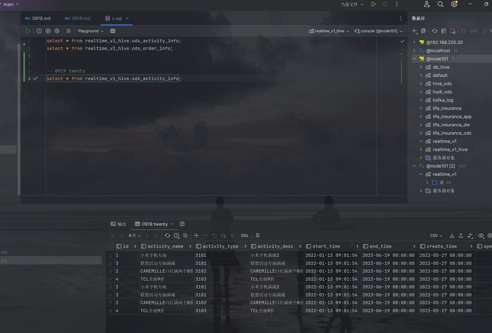
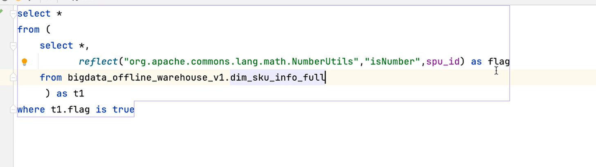

### twenty 0925
1. 解决idea 中SparkSession 的pyspark的报错
>
    解决办法 加载python 插件,配置环境变量
    >
    以及软件包install 配置python编辑器
    >
    >

2.写py脚本 并查看是否可以运行
>
> 

3.(ue400-u9fa5)中文的accise编码

4.
查看了解reflect的使用方法 
>调用的idea里面的方法 (有些方法和jar包不可取)
> isNumber类型
> 
> 这个方法体现在业务上逻辑思维 