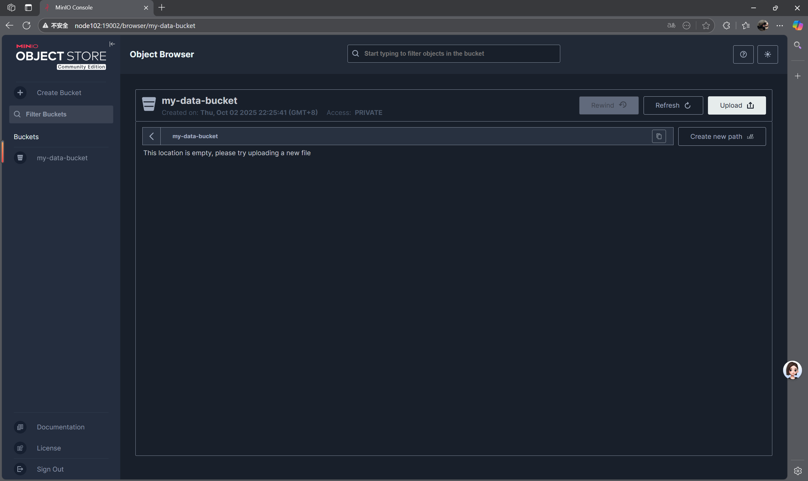
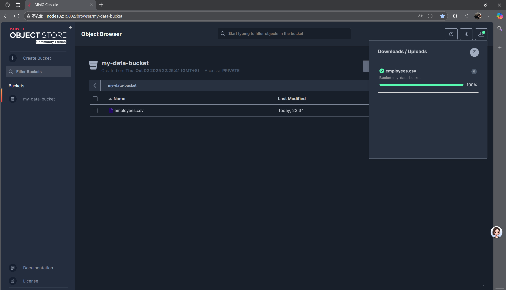

### twenty 10.1 
Minio 安装
1. 使用dcoker进行安装
下载命令:wget https://dl.min.io/server/minio/release/linux-amd64/minio
2. 给予权限
权限命令：chmod +x minio
3. 创建文件存放路径
mkdir -p /opt/software/minio-data
chown -R root:root /opt/software/minio-data
4. 端口 （被占可改变）
sudo./minio server /opt/software/minio-data --console-address":19002" --address":19000"

5. 上传csv文件
