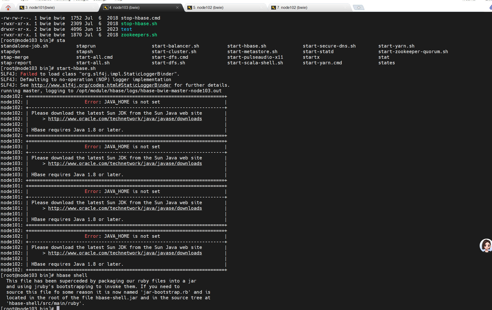
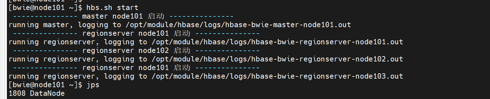
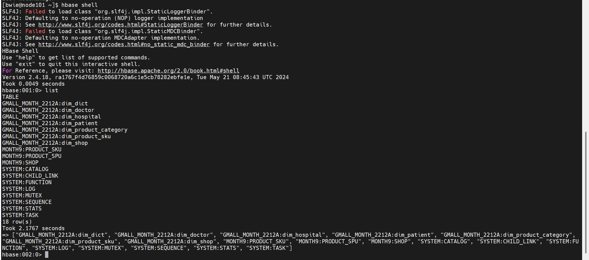

### twenty 10.2
1.在node103节点上配置hbase2.1

2.查看hbase rowkey的企业原则
    主键必须是唯一的,确保每个rowkey对应一条唯一的数据记录 
    rowkey的长度不应该过长 避免占用过多内存 导致频繁的flush操作
    rowkey 应能够均匀分布到各个RegionServer上
    时间戳反转

3.hbase 异常
linux 无法使用hbase shell 进入hbase

使用python脚本也没有将hbase的数据查询出来

hbase启动成功

查询hbase表

