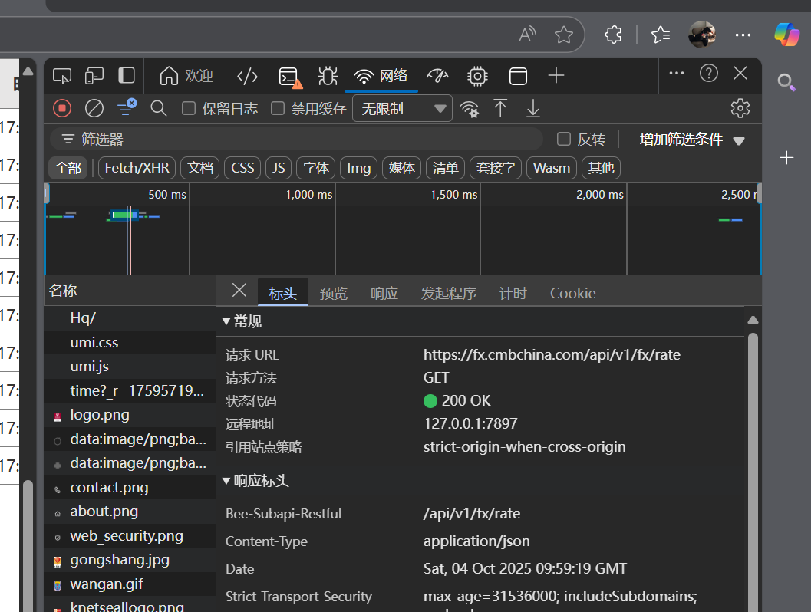
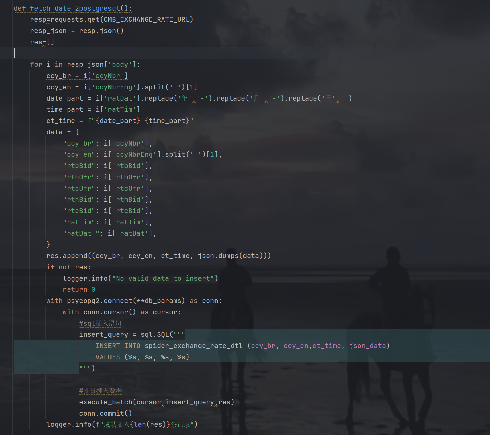
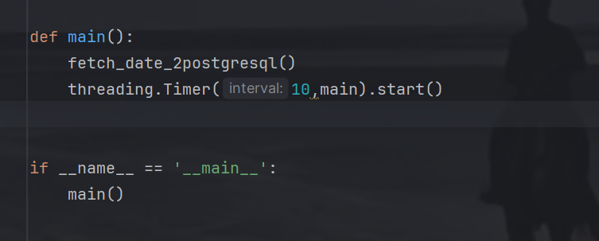
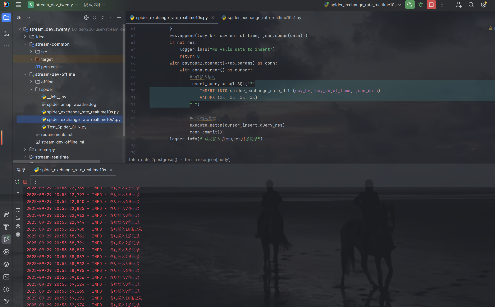
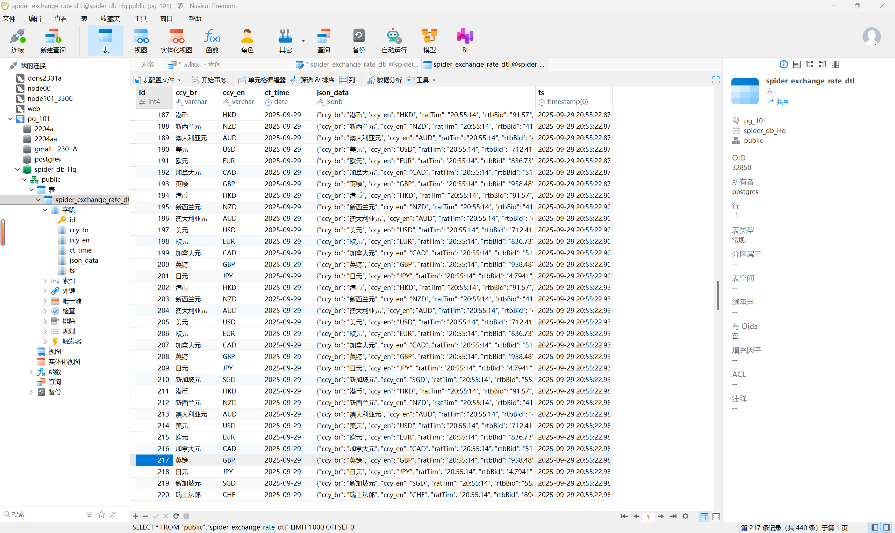
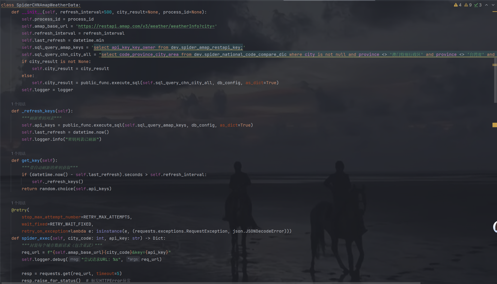
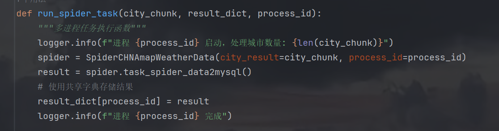
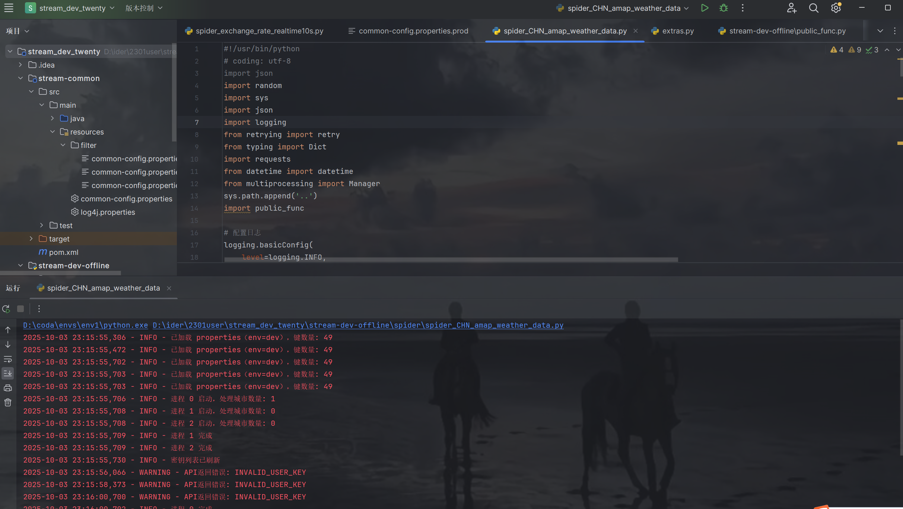

### twenty 10.3
1.爬取中国外汇当日市场数据10s更新一次 增量更新
    在中国外汇上爬取接口 找到数据源
    >

写脚本
# 配置日志
    logging.basicConfig(
    level=logging.INFO,
    format='%(asctime)s - %(levelname)s - %(message)s',
    handlers=[
    logging.FileHandler('spider_amap_weather.log'),
    logging.StreamHandler()
    ]
    )
    logger = logging.getLogger(__name__)

# 连接pg数据库
    db_params={
    "host": "192.168.200.102",
    "port": "5432",
    "database": "spider_db_Hq",
    "user": "postgres",
    "password": "123456"
    }

# 反爬
headers = {
'User-Agent': 'Mozilla/5.0 (Windows NT 10.0; Win64; x64) AppleWebKit/537.36 (KHTML, like Gecko) Chrome/91.0.4472.124 Safari/537.36',
'Accept': 'application/json, text/plain, */*',
'Accept-Language': 'zh-CN,zh;q=0.9,en;q=0.8',
}

从指定 URL 获取汇率数据，对数据进行处理后，批量插入到 PostgreSQL 数据库中
>

调用方法 时间十秒一次
>

效果

2.爬取中国天气预报数据10s更新一次 增量更新
# 配置日志
logging.basicConfig(
level=logging.INFO,
format='%(asctime)s - %(levelname)s - %(message)s',
handlers=[
logging.FileHandler('spider_amap_weather.log'),
logging.StreamHandler()
]
)
logger = logging.getLogger(__name__)

# 数据库配置
RETRY_MAX_ATTEMPTS = 3
RETRY_WAIT_FIXED = 2000
num_processes = 3
properties = public_func.get_java_properties()

db_config = {
'host': "192.168.200.102",
'port': "5432",
'user': "postgres",
'password': "123456",
'database': "postgres"
}

该类用于实现从高德地图 API 爬取天气数据并插入数据库的功能。
>

run_spider_task 函数
创建实例，执行数据爬取和插入任务，将结果存入共享字典，并记录进程启动和完成的日志。
>

if __name__ == '__main__':
当脚本直接运行时，执行 main 函数，启动整个数据爬取、插入和结果推送的流程。

效果
>

