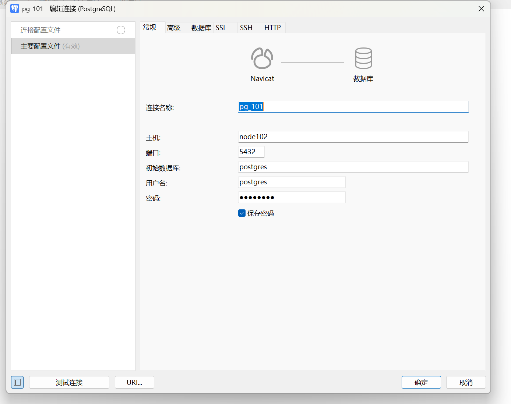

### twenty 10.5
1.安装postGreSQL 
Navicat Premium17 新建连接 
配置属性 连接postgre

2.安装sql server
    下载官方sql server 2019源到本地
wget -O /etc/yum.repos.d/mssql-server.repo https://packages.microsoft.com/config/rhel/8/mssql-server-2019.repo

    linux安装命令
yum install -y mssql-server

