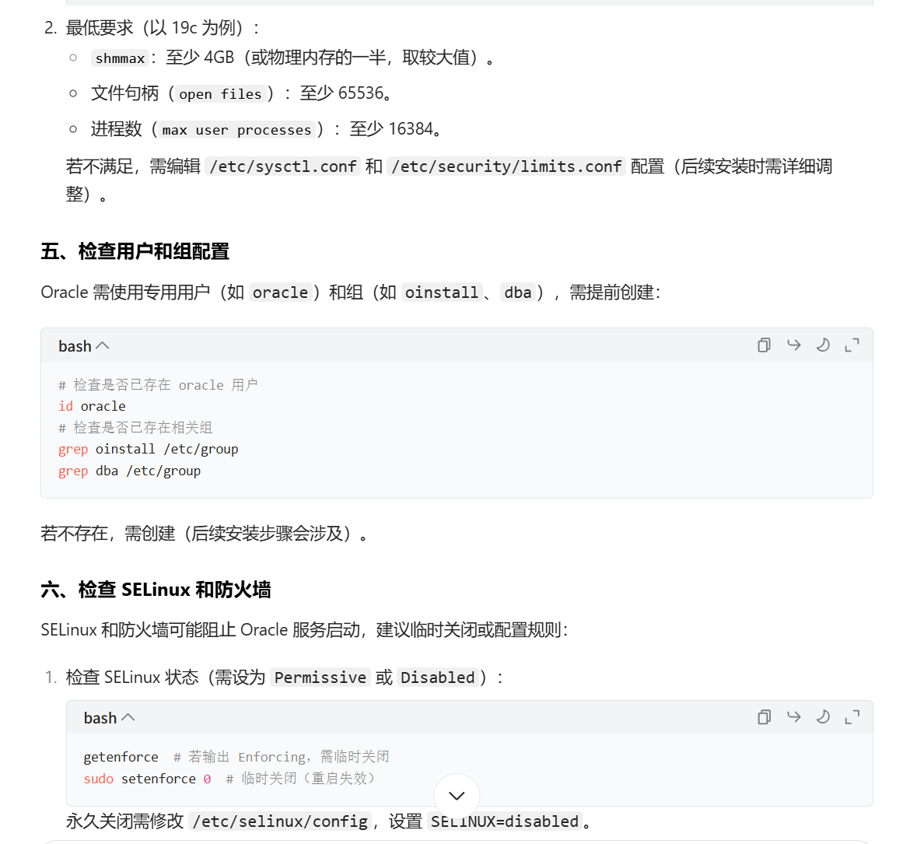
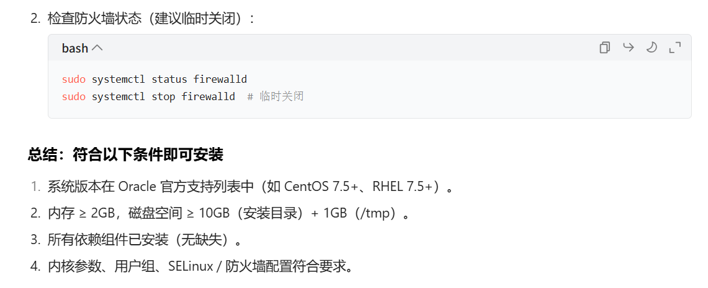
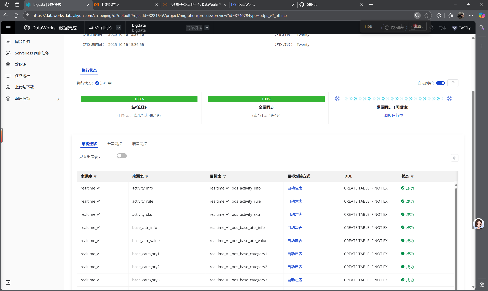
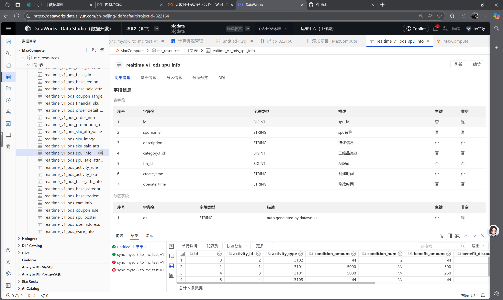

### 2525/10/16 twenty 
1.cont OS 安装oracle
    contOs的版本是contos7的版本
查看自己的linux是否可以安装oracle

运行命令：yum -y install libnsl
信息：
Loaded plugins: fastestmirror, langpacks
Loading mirror speeds from cached hostfile
Could not retrieve mirrorlist http://mirrorlist.centos.org/?release=7&arch=x86_64&repo=os&infra=stock error was
14: curl#6 - "Could not resolve host: mirrorlist.centos.org; Unknown error"

One of the configured repositories failed (Unknown),
and yum doesn't have enough cached data to continue. At this point the only
safe thing yum can do is fail. There are a few ways to work "fix" this:

     1. Contact the upstream for the repository and get them to fix the problem.

     2. Reconfigure the baseurl/etc. for the repository, to point to a working
        upstream. This is most often useful if you are using a newer
        distribution release than is supported by the repository (and the
        packages for the previous distribution release still work).

     3. Run the command with the repository temporarily disabled
            yum --disablerepo=<repoid> ...

     4. Disable the repository permanently, so yum won't use it by default. Yum
        will then just ignore the repository until you permanently enable it
        again or use --enablerepo for temporary usage:

            yum-config-manager --disable <repoid>
        or
            subscription-manager repos --disable=<repoid>

     5. Configure the failing repository to be skipped, if it is unavailable.
        Note that yum will try to contact the repo. when it runs most commands,
        so will have to try and fail each time (and thus. yum will be be much
        slower). If it is a very temporary problem though, this is often a nice
        compromise:

            yum-config-manager --save --setopt=<repoid>.skip_if_unavailable=true

Cannot find a valid baseurl for repo: base/7/x86_64
这个错误和之前类似，核心还是 yum 源无法连接（DNS 解析失败 + 官方源失效）

解决yum切换国内数据源

2.阿里云的dataworks数据同步
    阿里云利用rds同步完成
    阿里云利用云服务器ecs连接mysql成功
    阿里云整库数据同步完成

    
